# Projekt dokumentáció: Patyizgatunk („Kimaradás”)

| | |
|---|---|
| **Platform** | Asztali alkalmazás (Windows, 64 bit) |
| **Technológia** | Godot Engine 4.7.2 (.NET), C# (.NET 8) |
| **Csapat** | Girán Zsombor, Sándor Gergő, Molnár János |
| **Git repository** | https://github.com/DrZsombi123/Patyizgatunk |
| **Projekttábla (Trello)** | https://trello.com/b/Jb7AZ2yB/patyizgatunk |
| **Futtatható állomány** | GitHub Releases: `Patyizgatunk-v1.0-windows-x64.zip` |
| **Fejlesztési időszak** | 2026.09.07. (tervezés) – 2026.10.08. (kiadás) |

## Tartalom

1. Az alkalmazás célja
2. Telepítés és futtatás
3. Használati útmutató
4. Fejlesztői dokumentáció
5. UI terv (drótváz és képernyőképek)
6. Tesztelés
7. Git verziókövetés
8. Projektmenedzsment
9. Továbbfejlesztési lehetőségek
10. Önértékelés és tanulságok

---

## 1. Az alkalmazás célja

A Patyizgatunk egy felülnézetes, 2D pixel-art humoros játék. A játékban a címképernyő szerinti neve „Kimaradás”. A játékos Kunu Máriót irányítja, akit mindenhová követ a haverja, Lakatos Brendon. Egy kisváros utcáin lehet vásárolni, hajat vágatni, autózni a Mercivel, TikTok élőzni a telefonról, kaszinózni és menekülni a rendőrök elől.

Minden cselekedet **AURA** pontot ad vagy elvesz. **A játék célja 500 aura összegyűjtése**: ekkor a győzelmi képernyőn az egész város Márióért táncol. Az úthoz nyolc egymásra épülő küldetés ad irányt.

---

## 2. Telepítés és futtatás

### Futtatható változat (ajánlott)

1. Töltsd le a GitHub repository **Releases** oldaláról a `Patyizgatunk-v1.0-windows-x64.zip` fájlt.
2. Csomagold ki egy tetszőleges mappába.
3. Indítsd el a `Patyizgatunk.exe` fájlt.
   - Az exe mellett maradjon ott a `Patyizgatunk.pck` és a `data_Patyizgatunk_windows_x86_64` mappa is, mert ezek nélkül nem indul el.

**Rendszerkövetelmény:** Windows 10/11 64 bit, DirectX 12-t támogató videokártya. A .NET futtatókörnyezet benne van a csomagban, külön telepíteni nem kell.

### Futtatás forráskódból (fejlesztőknek)

1. Telepítsd a **Godot 4.7.2 .NET** (mono) kiadást és a **.NET 8 SDK**-t (vagy újabbat).
2. Klónozd a repository-t:
   ```
   git clone https://github.com/DrZsombi123/Patyizgatunk.git
   ```
3. A Godotban nyisd meg a `project.godot` fájlt, majd nyomj **F5**-öt.

**Exe készítése:**
- A Godot szerkesztőben: *Projekt → Exportálás → Windows Desktop* (az export sablonokat egyszer telepíteni kell).
- Parancssorból:
  ```
  Godot_v4.7.2-stable_mono_win64_console.exe --headless --path . --export-release "Windows Desktop" build/Patyizgatunk.exe
  ```

### Mentések helye

- Játékmentés: `%APPDATA%\Godot\app_userdata\Patyizgatunk\save.cfg`
- Beállítások: `settings.cfg`, ugyanebben a mappában.

---

## 3. Használati útmutató

### 3.1 Főmenü

| Gomb | Funkció |
|---|---|
| **Játék** | Új játék indítása (ha még nincs mentés) |
| **Folytatás** | A mentett játék betöltése (ha van mentés) |
| **Új játék** | Második kattintásra („Biztos? Mentés törlése”) törli a mentést, és újat kezd |
| **Beállítások** | Hangerő-csúszka és V-sync, azonnal mentődnek |
| **Alkotók** | A csapattagok nevei |
| **Kilépés** | Kilépés a játékból |

### 3.2 Irányítás

| Billentyű | Funkció |
|---|---|
| **W A S D** | Mozgás; vezetés közben gáz/fék (W/S) és kormányzás (A/D) |
| **Space** | Ugrás |
| **E** | Interakció: beszélgetés NPC-vel, kaszinó asztal, rejtett gomb |
| **F** | Beszállás az autóba és kiszállás (kocsikulcs kell hozzá) |
| **1–6**, egérgörgő | Tárgy kiválasztása a zsebből (hotbar) |
| **Q** vagy **bal egérgomb** | A kiválasztott tárgy használata |
| **F1** | Telefon elővétele és elrakása |
| **N** | Nappal és éjszaka váltása |
| **Esc** | Párbeszéd vagy kaszinó bezárása; egyébként szünet menü |
| **1–9** (párbeszédben) | Válasz kiválasztása |

A billentyűk listája játék közben a bal alsó sarokban is látható.

### 3.3 Játékmenet

- **Pénz és aura:** a játék 50 000 Ft-tal és 0 aurával indul. Az aura a bal felső sarokban, a részegség szintje alatta látható. A pénz a párbeszédablak és a kaszinó fejlécében látszik, és Brendontól is megkérdezhető („Mennyi lóvém van?”).
- **Vásárlás:** az NPC-k előtt **E**-vel párbeszéd nyílik. A számmal vagy egérrel választott opció pénzbe kerülhet, és tárgyat adhat.

| Hol | Kitől | Mit | Ár |
|---|---|---|---|
| Sikátor | Sikátorember | patyi | 5 000 Ft |
| Bolt | Eladó | energiaital | 900 Ft |
| Kaszinó | Csapos | Jack Daniels | 3 500 Ft |
| Szórakozóhely | Csapos | Finlandia | 3 500 Ft |
| Fodrászat | Ferike | hajvágás (+10 aura 2 percig) | 3 000 Ft |
| Utca | Lakatos Brendon | kocsikulcs / pótkulcs | ingyen |

- **Tárgyak használata:**
  - patyi: „ULTRA PATYI MODE” effekt, gyorsulás és +25 aura;
  - pia: részegség és +5 aura;
  - energiaital: gyorsabb mozgás.
- **Részegség:**
  - 30% felett imbolyog a kép;
  - 50% felett elcsúszik az irányítás;
  - 70% felett kaotikus lesz;
  - 100%-nál kiütés: a karakter egy véletlen helyen ébred.
- **Autó:**
  - Brendontól el kell kérni a kulcsot, utána **F**-fel be lehet szállni a Merci-be.
  - Részegen vezetve aura jár, de kijöhetnek a rendőrök. Ilyenkor 8 másodpercig nem szabad megállni.
  - Ha elkapnak: bírság, −40 aura, és lefoglalják a kulcsot. Ezután Brendon pótkulcsot ad.
  - Éjszaka csak vezetés közben ég a fényszóró.
- **Telefon (F1):**
  - TikTok élő indítása: a nézők száma az aurától függ.
  - Lehet köszönni a nézőknek, rózsát kérni, és a kapott rózsát beváltani forintra.
  - Autóból élőzve plusz aura jár.
- **Kaszinó:** a négy játék (nyerőgép, rulett, huszonegy, kocka) az asztaloknál **E**-vel indul. A tét 500 és 10 000 Ft között állítható. Nagy nyereményért (legalább ötszörös) +10 aura jár.
- **Mentés:**
  - A játék 30 másodpercenként és kilépéskor automatikusan ment.
  - A szünet menüben „Mentés és főmenü” és „Mentés és kilépés” gomb is van.
- **Győzelem:** 500 aura elérésekor a győzelmi képernyő jelenik meg, a mentés pedig törlődik.

### 3.4 Küldetések

| # | Küldetés | Teljesítés | Jutalom |
|---|---|---|---|
| 1 | Kérd el Brendontól a kocsikulcsot | 1 kulcs | +10 aura |
| 2 | Vezess a mercivel | 30 mp vezetés | +10 aura |
| 3 | Vágasd le a hajad a fodrásznál | 1 hajvágás | +10 aura |
| 4 | Köszönj a nézőknek élőben | 3 köszönés | +10 aura |
| 5 | Szerezz rózsát TikTok élőben | 300 rózsa | +20 aura |
| 6 | Igyál kemény piát | 3 ital | +10 aura |
| 7 | Nyerj pénzt a kaszinóban | 20 000 Ft nyereség | +25 aura |
| 8 | Vezess, és rázd le a rendőröket | 1 sikeres menekülés | +30 aura |

---

## 4. Fejlesztői dokumentáció

### 4.1 Rendszerarchitektúra

- A játék a **Godot 4.7.2** motorban készült, a játéklogika **C#** nyelven íródott (.NET 8).
- Minden képernyő egy Godot *scene* (`.tscn`), a viselkedést a hozzájuk csatolt C# osztályok adják.
- Az alkalmazás **jelenetváltásokkal** navigál:

```
 TitleScreen.tscn ──► Options.tscn / Credits.tscn ──► vissza a TitleScreenre
        │
        ▼ Játék / Folytatás
   World.tscn ──Esc──► PauseMenu ──► TitleScreen vagy kilépés
        │
        ▼ aura ≥ 500
   Victory.tscn ──► TitleScreen
```

**A `World.tscn` felépítése:**
- **Világ:** egyetlen nagy pálya, három TileMapLayer rétegből (térkép, részletek, tárgyak).
- **Belső terek:** a boltok, a kaszinó és a klub ugyanezen a térképen, keletre vannak. Az ajtók (`Door`) teleportálnak oda.
- **Szereplők:** a játékos (`Player`), Brendon, az NPC-k, az autó (`Merci`).
- **Felület:** a felhasználói felület rétegei (`CanvasLayer`): Dialogue, Hotbar, Phone, CasinoGame, Quests, PauseMenu.
- **Mentés:** a `SaveGame` node legalul van. Így a `_Ready`-je már a kész világot tölti be, és a bezárási jelzést is utolsóként kapja meg.

**Tervezési döntések:**
- **Nincs autoload (globális singleton).** A UI modulok egy statikus `Current` tulajdonságon keresztül érhetők el (pl. `Quests.Report("pia")`, `Hotbar.Current.Add("kulcs")`). Ez a `_Ready`-ben áll be, és az `_ExitTree`-ben törlődik.
- **A felületek nagy része kódból épül** (Dialogue, Hotbar, Quests, Phone, CasinoGame, PauseMenu, Victory), nem külön `.tscn`-ből. Így a teljes UI egy helyen, verziókövethető kódként van meg.
- **Laza csatolás:** a játék többi része csak eseményt jelent (pl. `Quests.Report("vezetes")`), a küldetésrendszer dönti el, hogy ez számít-e.
- **NPC-k adatvezérelten:** az NPC-k szövegei és vásárlási opciói a scene-ben, exportált tömbökben vannak, `"felirat|hatás|ár|válasz"` formában. Új NPC-hez nem kell kódot írni.

### 4.2 Modulok és főbb osztályok

| Mappa | Osztály | Felelősség | Főbb tagok |
|---|---|---|---|
| `Scripts/Player` | `Player` (CharacterBody2D) | Mozgás, ugrás, pénz, aura, kulcs, tárgyhasználat, interakció | `AddAura(int)`, `Use(string)`, `DrinkPia(float)`, `TakePatyi()`, `GetHaircut()`, `Money`, `Aura`, `HasCarKey`, `KeySeized`, `WinAura` |
| | `DrunkSystem` | Részegség szintje, irányítás-torzítás, kiütés | `AddDrunk(float)`, `ModifyInput()`, `ModifyDrive()`, `GetStatusName()` |
| | `DrunkEffects` | Shaderes képtorzítás, elsötétítés | – |
| | `Step` (statikus) | Közös lépés-animáció (játékos, Brendon, táncosok) | `Parts()`, `Apply()` |
| `Scripts/World` | `Car` | Vezetés, autózene, rendőrség, lámpák | `ExitPosition`, `GetIn/GetOut`, `Busted()`, `Escaped()` |
| | `SaveGame` | Mentés és betöltés (`user://save.cfg`) | `Save()`, `Load()`, `Exists`, `Delete()` |
| | `DayNight` | Nappal és éjszaka, tile-alapú fények | `SetNight(float)` |
| | `Door`, `MusicRoom`, `Ducker` | Ajtók, helyiségzene, zene-halkítás | – |
| | `UltraPatyi` | Rejtett „Ultra Patyi” effekt | `Trigger(Player)` |
| `Scripts/Npc` | `Npc` | Párbeszéd és vásárlás | `Available(Player)`, `Choose(option, Player)` |
| | `Follower` | Brendon követése | – |
| | `Kukabuvar`, `Dancer` | Kukából kiugró figura, táncosok | – |
| `Scripts/Hud` | `Quests` | Küldetéslánc, felugró üzenetek | `Report()`, `Toast()`, `Index`, `Progress`, `Restore()` |
| | `Hotbar` | 6 rekeszes zseb | `Add()`, `Remove()`, `Restore()`, `Items`, `Counts` |
| | `Dialogue` | NPC párbeszédablak | `Open()`, `Close()`, `IsOpen` |
| | `AuraLabel`, `DrunkHud` | Aura-számláló és részegség-csík | – |
| `Scripts/Phone` | `Phone` (+`Phone.Ui`, `Phone.GiftBanner`) | Telefon, TikTok élő szimuláció, rózsák | `Followers`, `Roses` |
| `Scripts/Casino` | `CasinoGame` (+`.Slots`, `.Roulette`, `.Blackjack`, `.Dice`) | Kaszinó ablak, tét, kifizetés | `Open(game, Player)` |
| | `CasinoStation`, `RouletteWheel` | Asztalok a világban, animált rulettkerék | – |
| `Scripts/Menu` | `TitleScreen`, `PlayButton`, `SceneButton`, `Options`, `PauseMenu`, `Victory` | Menük és képernyők | `Options.Apply()` |
| `Tests` | `SmokeTest.gd` | Automata füstteszt (6. fejezet) | – |

### 4.3 Adatszerkezet

**Mentés:** a `user://save.cfg` egy Godot `ConfigFile` (INI-szerű szöveges fájl).

| Szekció | Kulcs | Típus | Jelentés |
|---|---|---|---|
| `player` | `position` | Vector2 | A játékos helye (autóban ülve a kiszállási pont) |
| `player` | `money` | int | Pénz (Ft) |
| `player` | `aura` | int | Aura (az ideiglenes hajvágás-bónusz nélkül) |
| `player` | `key` | bool | Van-e kocsikulcs |
| `player` | `key_seized` | bool | Lefoglalták-e már a kulcsot (pótkulcs) |
| `car` | `position`, `rotation` | Vector2, float | Az autó helyzete |
| `hotbar` | `items`, `counts` | string[6], int[6] | A zseb tartalma (`""` = üres rekesz) |
| `phone` | `followers`, `roses` | int | Követők, be nem váltott rózsák |
| `quests` | `index`, `progress` | int | Aktuális küldetés és haladás |

Példa mentésfájl:

```ini
[player]
position=Vector2(880, 764)
money=12345
aura=10
key=true
key_seized=true

[hotbar]
items=PackedStringArray("kulcs", "", "", "", "", "")
counts=PackedInt32Array(1, 0, 0, 0, 0, 0)

[quests]
index=1
progress=0
```

**Ami szándékosan nem mentődik:**
- a részegség és a futó tárgyhatások;
- a hajvágás;
- a nappal/éjszaka állapot;
- egy éppen futó élő adás.

**Memóriabeli adatszerkezetek:**
- **Küldetések:** a `Quests` egy rendezett tömbben tárolja őket:

  ```csharp
  private static readonly (string Title, string Event, int Target, int Aura)[] List =
  {
      ("Kérd el Brendontól a kocsikulcsot", "kulcs", 1, 10),
      ("Vezess a mercivel (mp)", "vezetes", 30, 10),
      ...
  };
  ```

- **Zseb (Hotbar):** két párhuzamos tömb, `string[] _items` és `int[] _counts`. Az azonos tárgyak egy rekeszbe gyűlnek.
- **NPC opciók:** exportált `string[] Options` tömb, pl.:

  ```
  "Add ide a kocsikulcsot!|kulcs|0|Nesze. De ha összetöröd, gyalog mész haza."
  ```

### 4.4 Felhasznált technológiák és eszközök

- **Motor:** Godot 4.7.2 .NET, Forward+ renderelő, Direct3D 12.
- **Nyelv:** C# 12 / .NET 8 a játékhoz, GDScript az automata teszthez.
- **Grafika:**
  - saját pixel-art karakterek és tárgyak (LibreSprite);
  - TileMap alapú pálya;
  - shader a részegség-effekthez (`Art/Shaders/nausea.gdshader`).
- **Verziókövetés és projektmenedzsment:** Git + GitHub, Trello.

---

## 5. UI terv (drótváz és képernyőképek)

### 5.1 Játék közbeni képernyő (HUD)

```
+----------------------------------------------------------------------+
| AURA 00042             +---- KÜLDETÉS ----+                          |
| Józan  0%              | Vezess a mercivel|                          |
| [=========          ]  |      12 / 30     |                          |
|                        +------------------+                          |
|          KÜLDETÉS KÉSZ: ... +10 AURA   (felugró üzenet)              |
|                                                                      |
|                  Lakatos Brendon                                     |
|                       (o)  (o)  <- Brendon és Márió                  |
|                                     F: beszállás                     |
|                                       [ MERCI ]                      |
|                                                       +------------+ |
| +---------------+                                     |  TELEFON   | |
| | WASD - Mozgás |                                     |  (F1-re    | |
| | Space - Ugrás |      [ 1 ][ 2 ][ 3 ][ 4 ][ 5 ][ 6 ] |  feljön)   | |
| | ...           |           6 rekeszes zseb           |            | |
| +---------------+                                     +------------+ |
+----------------------------------------------------------------------+
```

### 5.2 Főmenü

```
+-------------------------------------------+
|            (háttérvideó)                  |
|               Kimaradás                   |
|             [  Játék      ]               |
|             [ Beállítások ]               |
|             [  Alkotók    ]               |
|             [  Kilépés    ]               |
+-------------------------------------------+
```

### 5.3 Képernyőképek

A képeket a `Tests/SmokeTest.gd` automata teszt készítette a futó játékról.

| | |
|---|---|
| 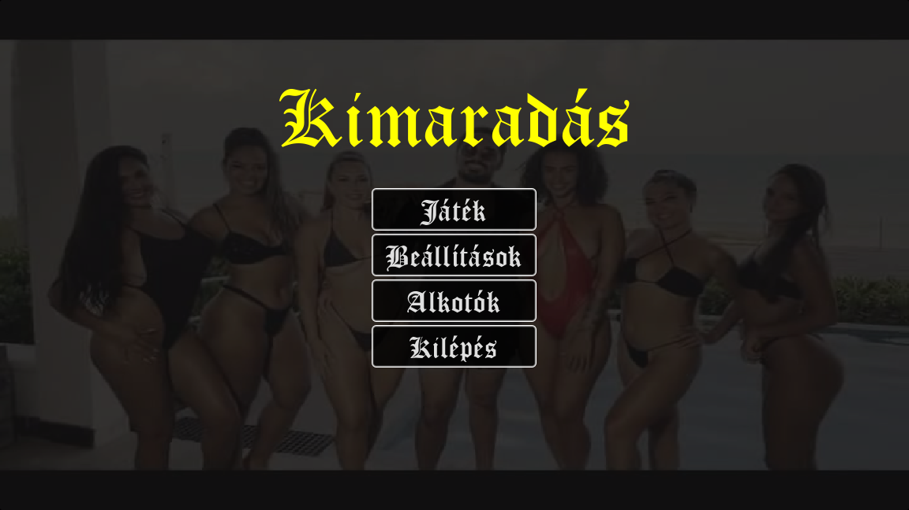 **Főmenü** | 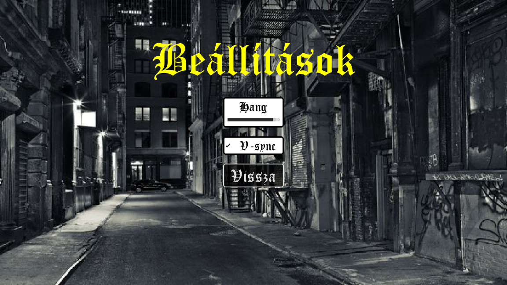 **Beállítások** |
| 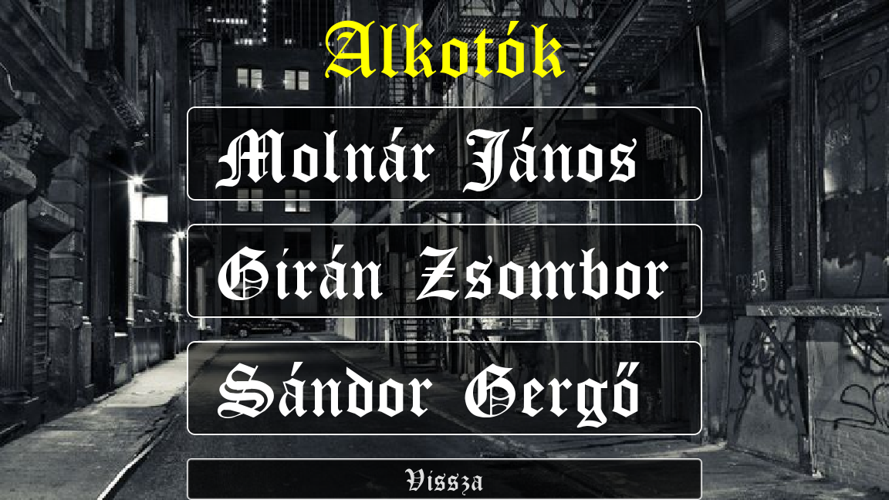 **Alkotók** | 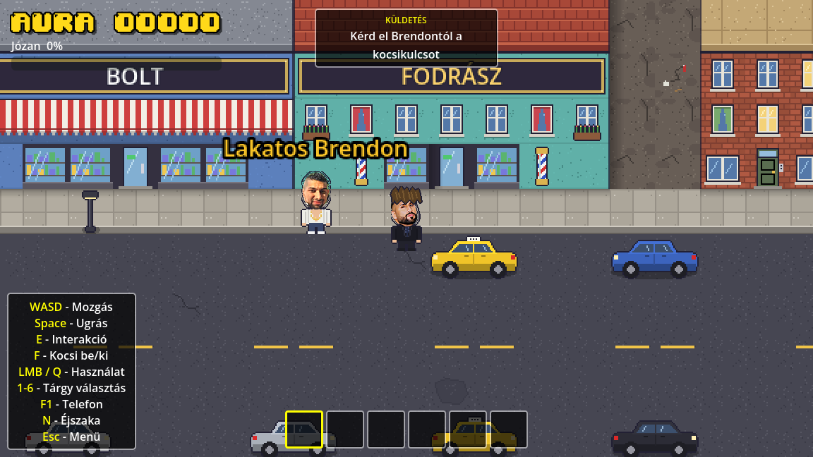 **Játék, HUD** |
| 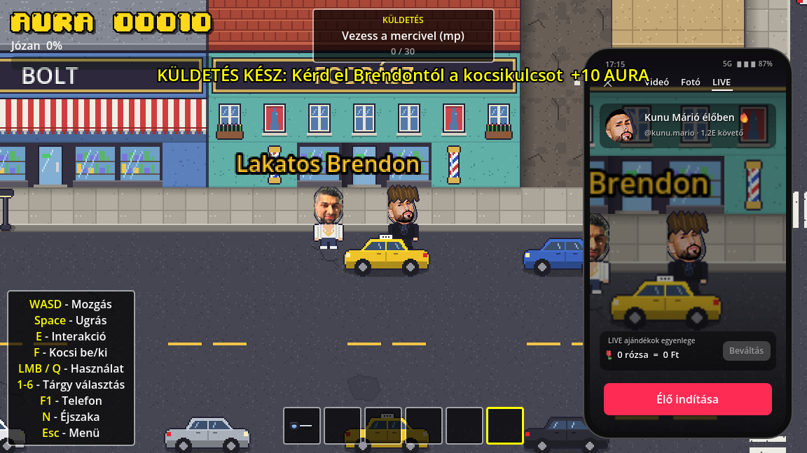 **Telefon (F1)** | 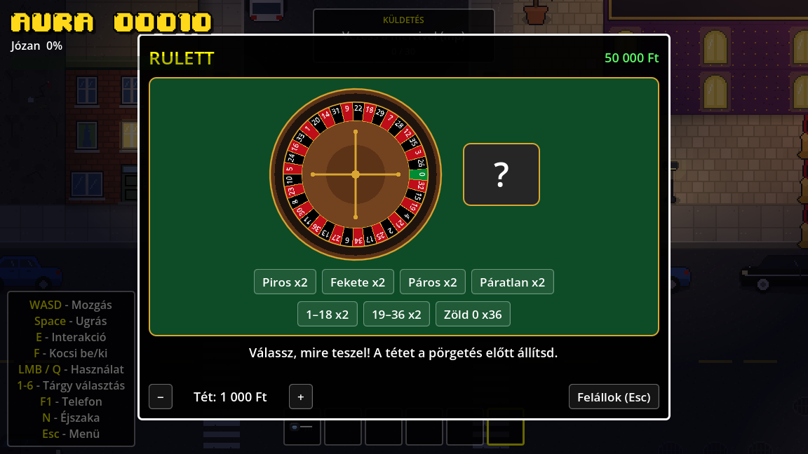 **Kaszinó: rulett** |
| 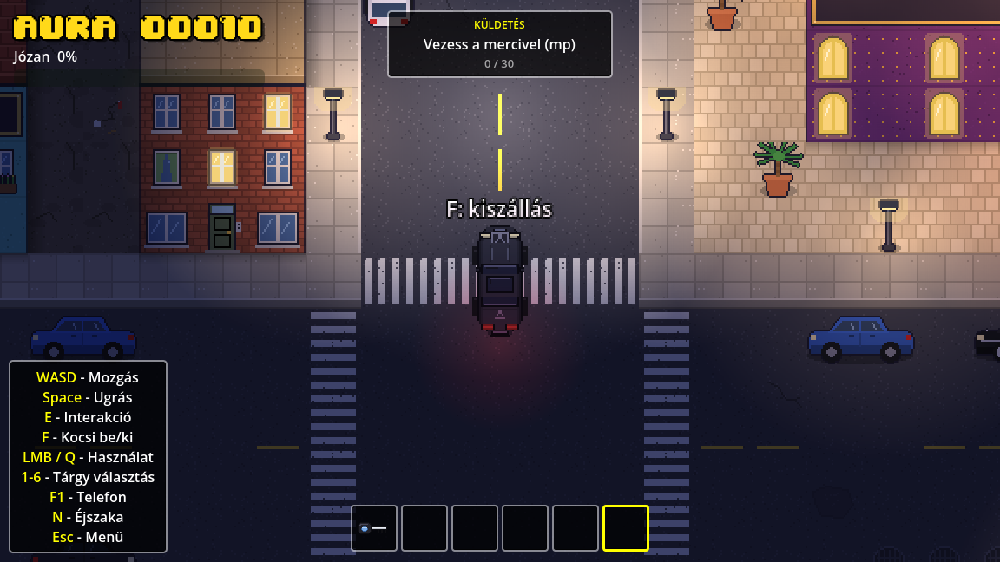 **Éjszaka, vezetés lámpákkal** | 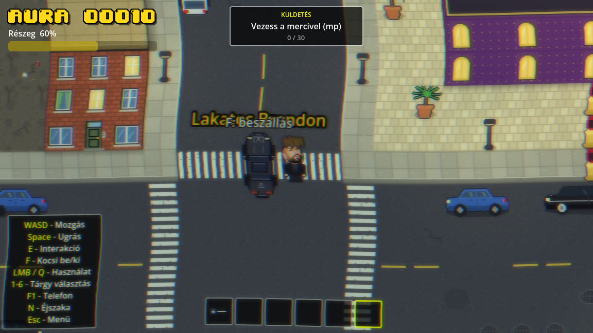 **Részegség-effekt** |
| 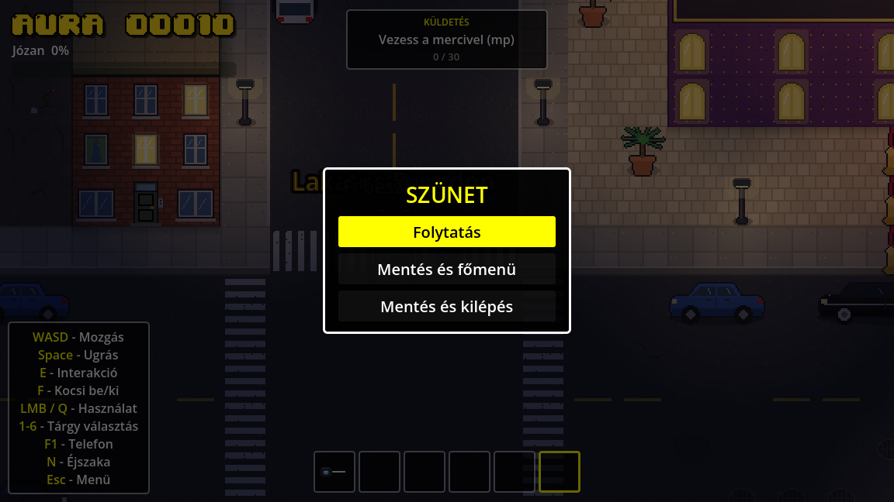 **Szünet menü (Esc)** | 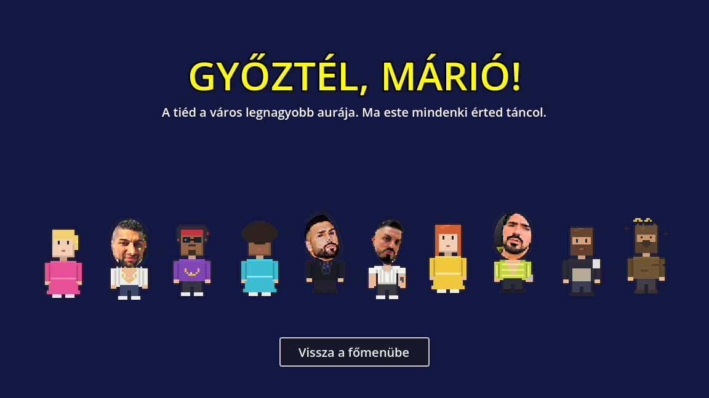 **Győzelmi képernyő** |

**Ergonómiai szempontok:**
- A fontos számok (aura, részegség, küldetés) mindig a képernyő tetején vannak.
- A billentyűkiosztás folyamatosan látszik.
- A menük egérrel és billentyűzettel (nyilak + Enter) is kezelhetők.
- A „Mentés törlése” két kattintást igényel, így nem lehet véletlenül elveszíteni a mentést.

---

## 6. Tesztelés

### 6.1 A tesztelés menete

1. **Folyamatos manuális tesztelés** fejlesztés közben.
   - A talált hibák a Trello **Hibák** oszlopába kerültek (6.3).
   - Javítás után a kártya átkerült a Kész oszlopba vagy archiválódott.
2. **Kódátvizsgálás („bug hunt”, 2026.09.29.).** A teljes kód átnézése után a javítások a `8aae1af` commitban kerültek be.
3. **Automata füstteszt** (`Tests/SmokeTest.gd`).
   - Végigmegy a főbb funkciókon, és mindegyiket ellenőrzi.
   - Közben képernyőképeket ment a `docs/img` mappába.
   - A meglévő mentést félreteszi, a végén visszaállítja.
   - Futtatás a projekt gyökeréből:
     ```
     Godot_v4.7.2-stable_mono_win64_console.exe --path . -s res://Tests/SmokeTest.gd
     ```
     A kilépési kód a hibás tesztesetek száma, tehát 0 = minden rendben.
4. **Kiadás előtti ellenőrzés:** fordítás, exe export és az exe elindítása.

**Tesztkörnyezet:** Windows 11 Pro, Godot 4.7.2 .NET, .NET SDK 10.0.401 (net8.0 cél). Dátum: 2026.10.08.

### 6.2 Tesztelési jegyzőkönyv

| ID | Tesztelt funkció | Bemenet / lépések | Elvárt kimenet | Valós kimenet | Eredmény |
|---|---|---|---|---|---|
| TC-01 | C# fordítás | `dotnet build` | 0 hiba | 0 figyelmeztetés, 0 hiba | SIKERES |
| TC-02 | Windows export | `--export-release "Windows Desktop"` | Elkészül az exe, a pck és a .NET adatmappa | `Patyizgatunk.exe` (105 MB) + `.pck` (49 MB) + adatmappa | SIKERES |
| TC-03 | Az exe elindul | `Patyizgatunk.exe --headless --quit-after 300` | Hiba nélkül fut és kilép | 0-s kilépési kód; kilépéskor 2 „resource still in use” figyelmeztetés (nem okoz hibát) | SIKERES |
| TC-04 | Főmenü | A TitleScreen betöltése | A gombok megjelennek | Játék, Beállítások, Alkotók, Kilépés | SIKERES |
| TC-05 | Beállítások | Az Options menü betöltése | Megjelenik a hangerő és a V-sync | Megjelent | SIKERES |
| TC-06 | Alkotók | A Credits betöltése | Mindhárom csapattag neve látszik | Molnár János, Girán Zsombor, Sándor Gergő | SIKERES |
| TC-07 | Új játék | A World betöltése mentés nélkül | 50 000 Ft, 0 aura, 1. küldetés | pénz=50000, aura=0, küldetés=0 | SIKERES |
| TC-08 | Mozgás | D gomb 0,5 mp-ig | A karakter jobbra megy | x: 880 → 940 | SIKERES |
| TC-09 | Brendon opciói | Kulcs nélkül, nem lefoglalt kulccsal | A kocsikulcs kérhető, a pótkulcs nem | csak „kulcs” | SIKERES |
| TC-10 | Kocsikulcs elkérése | „Add ide a kocsikulcsot!” | Kulcs a zsebben, az 1. küldetés teljesül | kulcs=true, küldetés=1 | SIKERES |
| TC-11 | Pótkulcs | A kulcsot lefoglalták | Csak a pótkulcs kérhető | csak „potkulcs” | SIKERES |
| TC-12 | Tele zseb | 6+ különböző tárgy hozzáadása | A 6. rekesz után nem fér több | 5 új tárgy fért be a kulcs mellé, a 6. nem | SIKERES |
| TC-13 | Telefon | F1 | A telefon feljön, az élő kamera renderel | Feljött | SIKERES |
| TC-14 | Éjszaka | N, 2 mp várakozás | A kép elsötétül (éjszakai szín) | (0.26, 0.28, 0.46) | SIKERES |
| TC-15 | Beszállás, lámpák | Kulccsal az autó mellett F, éjjel | A játékos az autóban; csak vezetés közben ég a lámpa | kocsiban=true, lámpa=true (parkolva nem égett) | SIKERES |
| TC-16 | Kiszállás | F vezetés közben | A játékos kiszáll | Kiszállt | SIKERES |
| TC-17 | Szünet | Esc | Megjelenik a szünet menü, a játék megáll | Megállt | SIKERES |
| TC-18 | Folytatás | Esc újra | A játék folytatódik | Folytatódott | SIKERES |
| TC-19 | Részegség | +60% részegség | „Részeg” fokozat, torzított kép | „Részeg” | SIKERES |
| TC-20 | Mentés | Pénz = 12 345, kulcs lefoglalva, bezárási jelzés | A `save.cfg`-ben benne vannak az értékek | money=12345, key_seized=true | SIKERES |
| TC-21 | Betöltés | A World újratöltése | Visszajön a pénz, a kulcs és a küldetés | pénz=12345, küldetés=1 | SIKERES |
| TC-22 | Győzelem | +500 aura | Győzelmi képernyő, a mentés törlődik | Victory, nincs `save.cfg` | SIKERES |

**Összesítés:** 22 tesztesetből 22 sikeres. Ebből TC-04–TC-22 az automata füstteszt: 19/19.

### 6.3 Hibakövetés (Trello „Hibák” oszlop)

| Hiba | Állapot |
|---|---|
| Autóban a zenelejátszás 1–2 mp után leáll | Javítva („Vezetés közben zenelejátszás”, `c566fc5`), archiválva |
| Kiszállás felirat elcsúszik forduláskor | Javítás: „Kiszállás felirat javítva” (`eedf98e`) |
| Bug hunt javítások (09.29.) | Javítva (`8aae1af`) |
| Ugrással nem lehet átugrani a járműveket | Nyitott, ellenőrizendő (a kód ugráskor kikapcsolja a jármű-ütközést) |
| A párbeszéd opciói nem frissülnek azonnal | Nyitott |
| Néha nem jelenik meg a „menekülj a rendőrök elől” esemény | Nyitott |

---

## 7. Git verziókövetés

### 7.1 Repository és branching stratégia

- **Repository:** https://github.com/DrZsombi123/Patyizgatunk (nyilvános). A Lead Developer hozta létre.
- **`main` ág:** mindig a működő, kiadható változat.
- **Feature ágak:** minden nagyobb funkció külön ágon készül, a nevük a funkcióra utal. Példák: `keybind-panel`, `Ultrapatyi`, `potkulcs`, `auto-vilagitas`, `icon-csere`.
- **Pull Request:** az ág GitHub Pull Requesttel kerül a `main`-be. A PR-t egy másik csapattag nézi át és merge-öli. A PR leírása hivatkozik a Trello kártyára.
- **Takarítás:** merge után a távoli ág törlődik.

**A stratégia kialakulása (őszintén):**
- **Kezdeti szakasz (09.18–09.20):** a commitok közvetlenül a `main`-re mentek. Ebben az időszakban egy merge konfliktust is meg kellett oldani („nemertem a githubot”, `0da8658`).
- **Lokális feature ágak (09.20–09.21):** a funkciók külön ágon készültek, és lokálisan lettek merge-ölve. Ilyen a *Titlescreen* (`be5b971`), a *Statusbar+points* (`f6879aa`) és a *Drunk driving* (`5967e8f`).
- **GitHub Pull Requestek (10.02-től):** minden változás PR-en keresztül került be.

| PR | Ág | Tartalom | Merge-ölte |
|---|---|---|---|
| #4 | `keybind-panel` | Billentyűkombináció panel javítva | Molnár János |
| #5 | `Ultrapatyi` | Ultrapatyi effekt a patyi itemhez | Molnár János |
| #6 | `potkulcs` | Letartóztatás után Brendon pótkulcsot ad | Girán Zsombor |
| #7 | `auto-vilagitas` | Autó világítás éjszakai módban | Girán Zsombor |
| #8 | `icon-csere` | Ikon cseréje | Girán Zsombor |
| #9 | `komment-takaritas` | Kódkommentek takarítása | – |
| #10 | `dokumentacio` | Dokumentáció, füstteszt, képernyőképek | – |

### 7.2 Commit statisztika

A 2026.09.18. és 2026.10.08. közötti, merge nélküli commitok:

| Csapattag | GitHub név | Commitok | Fő területek |
|---|---|---|---|
| Girán Zsombor | DrZsombi123 | 17 | Térkép, karakterek, autó, NPC-k, telefon, kaszinó, mentés, küldetések, szünet menü |
| Molnár János | Jxncsi | 16 | Projekt alapjai, mozgás, autózene, telefon és küldetés UI, billentyűpanel, Ultrapatyi |
| Sándor Gergő | SdGergo | 14 | Főmenü, beállítások, alkotók, részegség-rendszer, aura HUD, részeg vezetés |

A különböző gépeken használt Git-nevek egy névre vannak összevonva a `.mailmap` fájlban. Így a `git shortlog -sn` csapattagonként egy sort mutat.

### 7.3 Commit üzenetek (kivonat)

- `Godot projekt + mozgás gombok beállítás`
- `Mozgás (WASD, ugrás)`
- `map layout+barbershop`
- `Title screen es menuk elkeszitve`
- `részegség hozzáadva`
- `aurapont számláló és hud`
- `inventory+car sound effects`
- `Vezetés közben zenelejátszás`
- `tiktok live`
- `Save-Quest-Cleanup/Reorder`
- `Telefon UI javítás`
- `Bug hunt fixes, Radics Attila, pause menu, code cleanup`
- `Billentyűkombináció panel javítva`
- `Letartóztatás után Brendon pótkulcsot ad`
- `Autó világítás éjszakai módban`

---

## 8. Projektmenedzsment

### 8.1 Módszertan

- A csapat **Kanban-alapú, Scrum-elemeket használó** agilis módszerrel dolgozott.
- **Feladatbontás:** a feladatok a Trello táblán kártyákként éltek. A kártyák felelőst és leírást (elfogadási feltételeket) kaptak.
- **Megbeszélések:** a csapat rendszeresen egyeztetett, a Scrum Master vezetésével. Itt dőlt el, melyik kártya kerül a „Folyamatban” oszlopba.
- **A tábla oszlopai:**

| Oszlop | Szerepe |
|---|---|
| **Teendő** | Backlog: tervezett funkciók és ötletek |
| **Hibák** | A tesztelés során talált hibák |
| **Folyamatban** | Amin éppen dolgozik valaki |
| **Kész** | Elkészült és a `main`-be került funkciók |

**Trello tábla:** https://trello.com/b/Jb7AZ2yB/patyizgatunk (tagok: Gergő Sándor, Jxncsi, Zsombor Girán)

**Kész kártyák és felelőseik a Trellón:**

| Kártya | Felelős | Leírás (röviden) |
|---|---|---|
| Játék map | Zsombor | Házak, kaszinó, bolt, szórakozóhely, utcák, sikátor, fodrász |
| Autó | János | Zene mentése és folytatása ki- és beszálláskor, távolságfüggő hangerő |
| Mozgás | János | WASD, Space ugrás, F autó, E felvétel |
| Main menü | Gergő | Play, Exit, Settings, Credits |
| Statisztika | Gergő | Aura pontok, statusbar |
| Részegség állapot | Gergő | Finlandia, Jack; fokozódó effektek, 100%-on kiütés |
| Részeg vezetés | Gergő | Részegen torzul a vezetés |
| Telefon | János, Zsombor | F1-re animációval feljön, TikTok élő, rózsák |
| Fodrászat | Zsombor | Ferike vágja a hajat, idővel visszanő (auravesztés) |
| Modellek | Zsombor | Karakterek, autó, épületek (LibreSprite) |
| Inventory rendszer | Zsombor | Tárgyak a zsebben |
| „Nyerés” | Zsombor | Megadott aurapontnál győzelmi oldal |
| Patyi | Gergő, Zsombor | – |
| Ultrapatyi effekt (külön branchen) | János | Ultrapatyi animáció a patyi itemhez |
| Icon.svg-t kicserélni | Zsombor | Saját alkalmazásikon |

### 8.2 Szerepkörök

| Szerepkör | Csapattag | Feladatai a projektben |
|---|---|---|
| **Scrum Master / Projektkoordinátor** | Molnár János | A Trello tábla és a haladás követése, a megbeszélések vezetése, a stakeholder-térkép és a projektdokumentáció gondozása. Ellenőrzi, hogy mindenki rendszeresen commitol. Merge-ölte a #4 és #5 PR-t. |
| **Lead Developer / Vezető fejlesztő** | Girán Zsombor | A GitHub repository létrehozása és a branching stratégia. Az architektúra (scene-felépítés, statikus `Current` UI modulok, mentési formátum) és a fő játéklogika (autó, NPC-k, telefon, kaszinó, mentés, küldetések). PR-ek elbírálása, merge konfliktusok kezelése, kiadás (exe). |
| **UI/UX tervező és tesztelő (QA)** | Sándor Gergő | A menük (főmenü, beállítások, alkotók) és a HUD (aura-számláló, részegség-csík) tervezése és megvalósítása. A részegség-rendszer. A szoftver tesztelése és a hibák dokumentálása a Trello „Hibák” oszlopában, a termékdemó előkészítése. |

### 8.3 Feladatosztási mátrix

**F** = felelős, **K** = közreműködő (a commit history és a Trello kártyák alapján).

| Modul / feladat | Girán Zsombor | Sándor Gergő | Molnár János |
|---|---|---|---|
| Git repository, branching, PR-ek | F | | K |
| Godot projekt alapjai, mozgás, ugrás | | | F |
| Pálya, épületek, belső terek | F | | |
| Karakterek, modellek (pixel art) | F | | |
| Főmenü, beállítások, alkotók | K | F | K |
| HUD: aura-számláló, részegség-csík | K | F | |
| Részegség-rendszer, részeg vezetés | K | F | |
| Autó, vezetés, rendőrség | F | K | K |
| Autózene, ki- és beszállás felirat | | | F |
| NPC-k, párbeszéd, vásárlás | F | | |
| Zseb (inventory) | F | | |
| Telefon, TikTok élő | F | | K |
| Telefon UI, küldetés box, billentyűpanel | | | F |
| Kaszinó (4 játék) | F | | |
| Küldetések, mentés | F | | K |
| Ultrapatyi effekt | F | | K |
| Pótkulcs, autó világítás | F | | |
| Tesztelés, hibakövetés | K | F | K |
| Projekttábla, stakeholder-térkép, megbeszélések | | | F |
| Dokumentáció, prezentáció | K | K | F |

### 8.4 Stakeholder-térkép

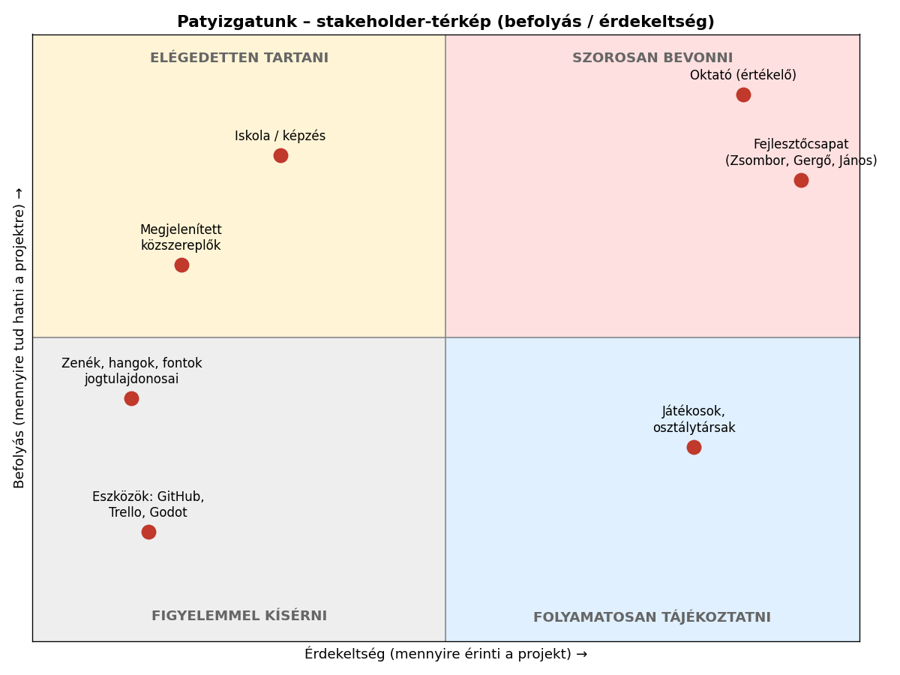

| Érintett | Befolyás | Érdekeltség | Elvárás | Kezelés |
|---|---|---|---|---|
| Oktató (értékelő) | Magas | Magas | Működő alkalmazás, szabályos Git- és PM-folyamat, dokumentáció | Szoros bevonás: rendszeres állapotjelentés, határidők betartása |
| Fejlesztőcsapat | Magas | Magas | Jó jegy, közös munka, élvezhető játék | Szoros bevonás: megbeszélések, Trello, PR review |
| Iskola / képzés | Magas | Alacsony | A tantervi követelmények teljesítése | Elégedetten tartani: a követelmények szerinti leadás |
| Játékosok, osztálytársak | Alacsony | Magas | Szórakoztató, hibamentes játék | Tájékoztatni: demó, visszajelzések gyűjtése |
| Megjelenített közszereplők | Közepes | Alacsony | Ne sértse a személyiségi jogaikat | Figyelni: nem kereskedelmi, paródia jellegű iskolai projekt |
| Zenék, hangok, fontok jogtulajdonosai | Közepes | Alacsony | Jogszerű felhasználás | Figyelni: nyilvános terjesztés előtt a licencek ellenőrzése |
| Eszközszolgáltatók (GitHub, Trello, Godot) | Alacsony | Alacsony | A felhasználási feltételek betartása | Figyelemmel kísérni |

---

## 9. Továbbfejlesztési lehetőségek

**A Trello „Teendő” oszlopából:**
- **Dinamikus vezetés.**
- **Hangok beállítása.**
- **Brendon reakciói:** véletlenszerű kiabálás, és köszönés az élő adásban.
- **Nyeréskor Brendon szerencsét kíván.**
- **Radics Attila táncoljon** a klubban.
- **Easter egg:** az egyik ház tetejére fel lehet menni, ahol Radics és Viktória kedves vár.
- **Minimap** a tájékozódáshoz.

**Technikai fejlesztések:**
- Több mentési hely, és a részegség, a nappal/éjszaka állapot mentése.
- Bővebb beállítások: teljes képernyő, felbontás, billentyűk átállítása.
- A pótkulcs korlátozása: a `KeySeized` most soha nem nullázódik, így a pótkulcs korlátlanul kérhető.
- Az Ultra Patyi rejtett gomb újrahasználhatósága miatt az aura gyűjthető. Ide várakozási idő kellene.
- A kaszinó szabályainak kiszervezése önállóan tesztelhető osztályokba, C# egységtesztekkel.
- GitHub Actions: automatikus fordítás és exe-készítés minden PR-nél.
- Új tartalom: további küldetések, helyszínek, többnyelvűség.

---

## 10. Önértékelés és tanulságok

**Ami jól sikerült:**
- Működő, tartalmas játék készült. Nyolc küldetés, négy kaszinójáték, telefon-szimuláció, részegség-rendszer, autózás és rendőrség került bele.
- A munka a szerepkörök szerint oszlott meg, és mindhárom csapattag rendszeresen commitolt (17 / 16 / 14 commit).
- A kód egységes stílusú, magyar kommentekkel. A modulok jól elkülönülnek (Player, World, Hud, Phone, Casino, Menu).

**Amit legközelebb másképp csinálnánk:**
- **Git-folyamat a projekt elejétől:** az első napokban közvetlenül a `main`-re dolgoztunk, ami merge konfliktushoz vezetett. A Pull Request alapú munkát csak a projekt végén vezettük be következetesen.
- **Commit üzenetek:** néhány üzenet túl általános („phone”, „Bug fix+ new things”). Jobb lenne egységes formátum (pl. `feat:`, `fix:`).
- **Tesztelés:** az automata teszt csak a végén készült el. Ha korábban megvan, a regressziókat hamarabb észrevettük volna.
- **Trello:** a kártyák mozgatása néha elmaradt a kódhoz képest, és néhány kártyán nincs felelős.
